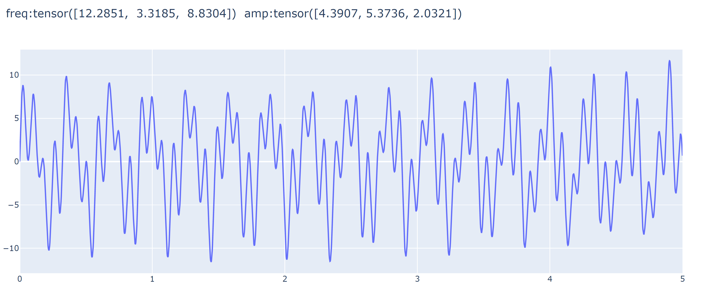
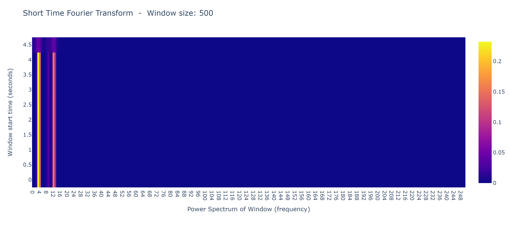

# ECG-src
### Using transforms.py
```python
from transforms import *
from generate import SinusoidDataSet
```
Creating one sin wave, containing a sum of 3 sins with random 
frequencies, sampled at 500 Hz over 5 seconds.
```python
ds = SinusoidDataSet(size=1, sinusoids=3, T=5, fs=500)
```
Initialize all the tranform objects
```python
stFT = stFourier(window_size=500, T=5, fs=500)
FT = Fourier(T=5, fs=500)
wavelet = Wavelet(np.logspace(0.05, 2.5, 50), T=5, fs=500)
PS = PowerSpec(T=5, fs=500)
```
Viewing the raw signal hosted at index 0
```python
signal = ds[0][0].numpy()
ds.viewTrueSignal(idx=0)
```

Viewing all the implemeted transforms
```python
stFT.view(signal)
```

```python
FT.viewComplex(signal)
```

```python
wavelet.view(signal)
```

```python
PS.view(signal)
```
All graph objects for viewing may be found in the notebook ```visualizing-signal-trfms.ipynb```
To obtain the transform as ndarray use ```__call__(signal)```:
```python
PS(signal)
```
